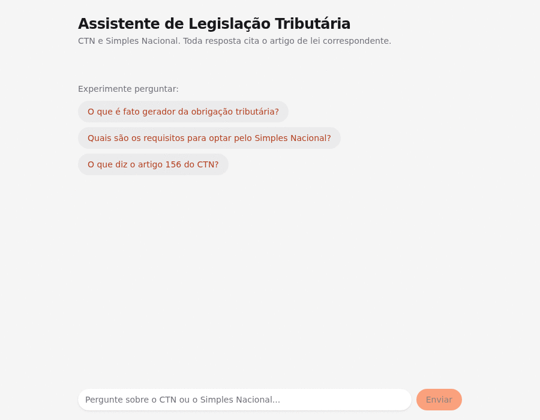

# Assistente de Legislação Tributária com RAG

Assistente de perguntas e respostas sobre legislação tributária brasileira (Código
Tributário Nacional + Simples Nacional), construído para demonstrar competências de
AI Engineering: RAG, busca híbrida, agentes com tool calling, avaliação com gabarito e
observabilidade — do zero, sem framework de RAG pronto.

**Este repositório é uma vitrine.** O código-fonte é privado; este README documenta a
arquitetura, as decisões técnicas e os resultados de avaliação. Código disponível sob
solicitação.



## O problema

Um modelo de linguagem genérico, perguntado sobre legislação tributária, responde com
confiança e frequentemente erra ou mistura artigos — sem nenhuma forma de verificar a
resposta contra a lei de verdade. Este projeto força o oposto: o agente só pode afirmar
o que está em um artigo efetivamente recuperado do texto oficial, cita esse artigo em
toda afirmação, e recusa explicitamente quando não encontra base legal — em vez de
inventar.

## Resultado da avaliação

63 perguntas com gabarito (artigo esperado), verificadas uma a uma contra o banco —
não é uma estimativa. Métrica: recall de citação (a resposta final cita o artigo
correto?).

```
Recall de citação geral: 42/63 (66.7%)
  fora_escopo:           10/10 (100.0%)  — nunca inventa/cita fora do escopo
  artigo_exato_simples:   4/5  (80.0%)
  conceito_ctn:          17/23 (73.9%)
  artigo_exato_ctn:       6/10 (60.0%)
  conceito_simples:       5/15 (33.3%)
```

O ponto mais importante não é o número — é o que ele revelou: a categoria mais fraca
(conceitos do Simples Nacional, 33%) tem uma causa identificada, não é ruído. Artigos
longos da LC 123/2006 (o Art. 3º tem 19 parágrafos) fazem o modelo, mesmo usando o
conteúdo certo do artigo certo, escrever um resumo geral sem citar cada afirmação —
uma falha de disciplina de formatação sob contexto denso, não de retrieval. Reduzir o
número de artigos retornados por busca e reforçar o prompt com um exemplo concreto
ajudou parcialmente, mas não eliminou o problema — ficou documentado como limitação
conhecida do modelo local usado nos testes, não escondido.

## Arquitetura

```
Planalto (HTML)
     │  scraper: parser HTML → estrutura jurídica (artigo/parágrafo/inciso),
     │  não por tamanho fixo; trata redações revogadas, riscados via CSS,
     │  artigos empacotados em um único <p>, HTML malformado
     ▼
PostgreSQL + pgvector  ──┬── embedding vetorial por artigo (busca semântica)
                         └── tsvector em português (busca full-text)
     │
     ▼
Busca híbrida (Reciprocal Rank Fusion)
     │  combina as duas listas por posição (rank), não por score bruto —
     │  evita ter que normalizar escalas incompatíveis (distância de
     │  cosseno vs. ts_rank)
     ▼
Agente (tool calling)
     │  2 ferramentas: busca semântica e busca exata por número de artigo
     │  prompt exige citação "(Lei X, Art. Y)" em toda afirmação
     │  recusa explícita quando a busca não encontra nada relevante
     ▼
API (streaming) → Chat web
     Server-Sent Events: o front vê o passo real do agente em tempo real
     ("Buscando o Art. 156 (CTN)...") e a resposta token a token — não é
     um spinner genérico, é o argumento de fato passado pra ferramenta.
```

## Decisões técnicas e o que elas ensinaram

- **Chunking por unidade jurídica, não por tamanho fixo.** Cada artigo (caput +
  parágrafos + incisos) é uma unidade de embedding, com o breadcrumb hierárquico
  (Livro/Título/Capítulo/Seção) como contexto adicional. Mas artigos muito longos
  (19 parágrafos) diluem o embedding — a busca semântica sozinha não rankeava bem o
  próprio artigo que define o conceito perguntado. Full-text não tem esse problema;
  é por isso que a fusão híbrida importa na prática, não só na teoria.
- **Citação obrigatória é uma restrição de prompt, não uma feature de retrieval.**
  Sem instruir explicitamente "chame uma ferramenta antes de QUALQUER resposta,
  mesmo pra temas fora de escopo", o modelo local às vezes recusava por raciocínio
  próprio em vez de buscar — quebrando a garantia de que toda resposta vem de uma
  busca real.
- **Modelo "de raciocínio" ≠ modelo melhor pra um agente com tools.** Testado em
  produção: um modelo free que gera ~300 tokens de *chain-of-thought* antes de
  decidir uma ferramenta simples tem latência de 13s a mais de 3 minutos,
  imprevisível, e uma vez produziu uma resposta completamente desconexa da
  pergunta. Trocado por um modelo menor sem fase de raciocínio separada: resposta
  em ~4-9 segundos, consistente. Para tool calling, "pensar em voz alta" é custo,
  não qualidade.
- **Bug de streaming em produção, não em teste.** Um caractere UTF-8 multibyte
  (emoji dentro do texto de raciocínio do modelo) partido entre dois pacotes de
  rede corrompia o parsing de JSON da resposta seguinte — silenciosamente, sem
  traceback óbvio, só respostas vazias. A causa: decodificar cada pacote de rede
  isoladamente antes de juntar linhas. Corrigido lendo bytes brutos e decodificando
  só depois de montar a linha completa.
- **Rate limit de tier free é real, não teórico.** A API de LLM gratuita usada
  devolveu 429 durante os próprios testes da sessão. A aplicação trata isso — e
  qualquer outro erro do modelo — como uma mensagem clara pro usuário, não como
  uma conexão quebrada ou um stack trace na tela.

## Stack

- **Ingestão / embeddings / agente:** Python
- **API:** FastAPI, streaming via Server-Sent Events
- **Frontend:** Next.js + HeroUI (React), streaming token a token
- **Banco:** PostgreSQL 16 + pgvector (busca vetorial) + tsvector (full-text)
- **LLM:** backend intercambiável — modelo local via Ollama (sem custo, sem
  limite de uso) ou API de nuvem (mais rápido, tier gratuito com rate limit)
- **Observabilidade:** Prometheus (latência de busca por tipo, taxa de "sem
  resultado", tokens consumidos, taxa de recusa)
- **Deploy:** Docker Compose, stack inteira containerizada

## Escopo e restrições

Cobre o Código Tributário Nacional (Lei nº 5.172/1966) e o Simples Nacional (Lei
Complementar nº 123/2006) — escopo deliberadamente limitado em vez de tentar toda a
legislação tributária brasileira de uma vez. Usa exclusivamente fontes públicas
(Planalto, Receita Federal).
